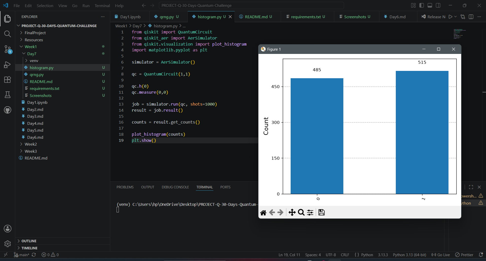
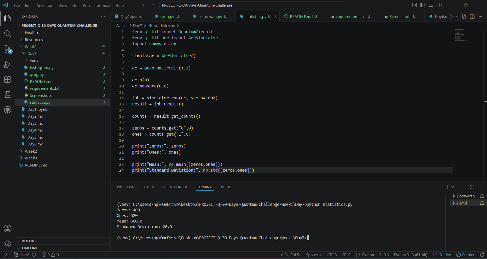
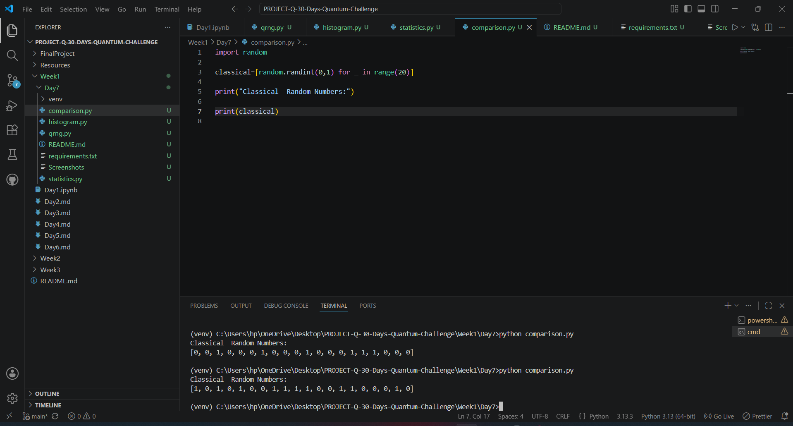

# Day 07 - Quantum Randomness Laboratory

## Overview

Today I built my first hands-on quantum computing mini project using **Qiskit**.

The objective was to understand how quantum randomness is generated using a qubit in superposition and compare it with Python's classical random number generator.

---

## Learning Objectives

- Create a quantum circuit using Qiskit
- Understand the role of the Hadamard (H) gate
- Generate quantum random bits
- Perform quantum measurement
- Execute circuits with multiple shots
- Visualize measurement results using histograms
- Calculate simple statistics
- Compare quantum randomness with classical randomness

---

## Technologies Used

- Python 3
- Qiskit
- Qiskit Aer
- Matplotlib
- NumPy

---

## Project Files

| File | Description |
|------|-------------|
| qrng.py | Generates a quantum random bit |
| histogram.py | Displays measurement outcomes as a histogram |
| statistics.py | Calculates counts, mean, and standard deviation |
| comparison.py | Compares quantum randomness with Python's random module |
| requirements.txt | Required Python packages |

---

## Quantum Circuit

The circuit consists of:

1. Initialize one qubit
2. Apply a Hadamard gate
3. Measure the qubit
4. Repeat for multiple shots

```
|0⟩
 │
 H
 │
 M
 │
Result
```

---

## Key Concepts Learned

### Superposition

The Hadamard gate creates an equal superposition:

```
(|0⟩ + |1⟩)/√2
```

---

### Measurement

Measurement collapses the qubit into either:

- 0
- 1

according to the probability amplitudes.

---

### Shots

Instead of measuring once, the circuit is executed many times (typically 1000 shots) to estimate the probability distribution.

---

## Results

The histogram shows approximately equal probabilities for measuring 0 and 1.

Example:

```
0 → 507

1 → 493
```

This demonstrates quantum randomness.

---

## Screenshots

### QRNG Output


---

### Histogram



---

### Statistics



---

### Classical vs Quantum Comparison



---

## What I Learned

This mini project helped me understand:

- Quantum circuits
- Hadamard gates
- Superposition
- Measurement
- State collapse
- Probability distributions
- Histogram visualization
- Statistical analysis
- Difference between classical and quantum randomness

---

## Resources

- IBM Quantum Learning
- Qiskit Documentation
- Microsoft Azure Quantum Documentation

---

**Day 07 of my 30 Days Quantum Computing Challenge**